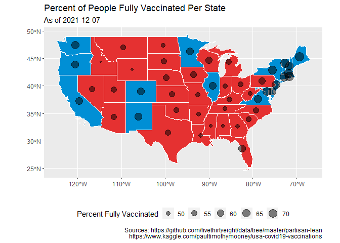
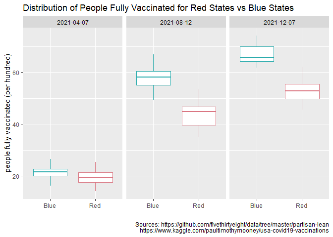
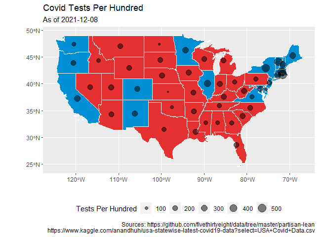
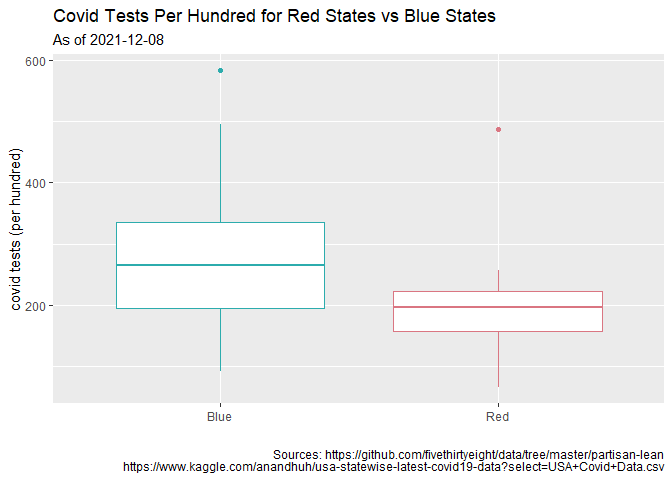
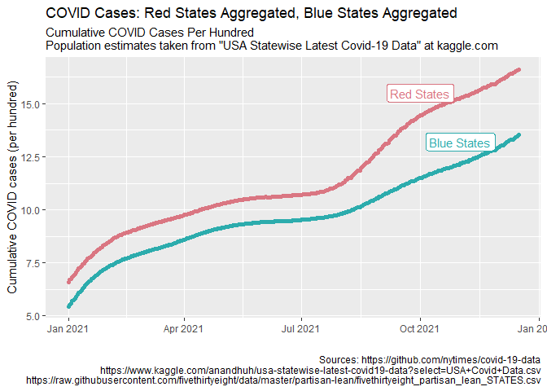
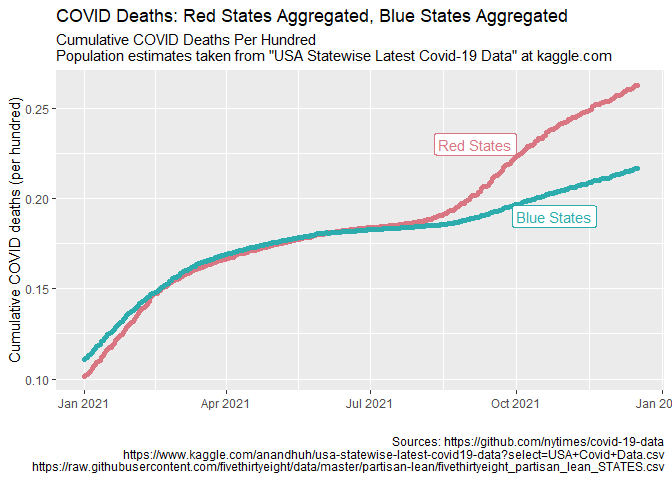
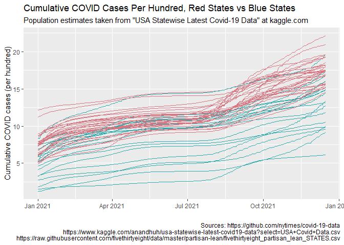
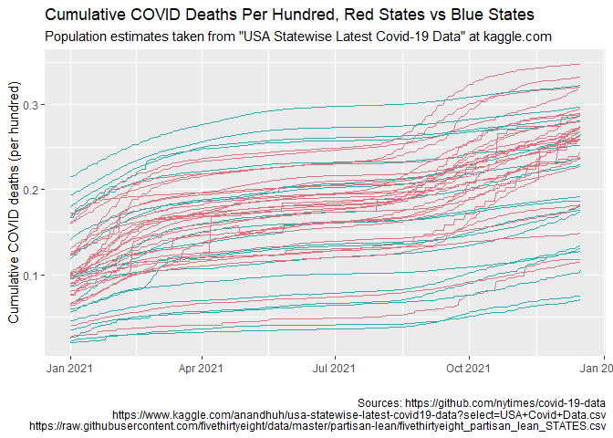

*** 

## Introduction

***

### How does a state's color, Red vs. Blue, affect different aspects of COVID?

#### Question 1: 

Is there a correlation between a state being red or blue and the percent of the state population that are fully vaccinated?

#### Question 2: 

Is there a correlation between a state being red or blue and the COVID testing per hundred?

#### Question 3:

Is there a correlation between a state being red or blue and the COVID cases per hundred?

#### Question 4:

Is there a correlation between a state being red or blue and the COVID deaths per hundred?

***

## Visualizations

***


```r
ggplot(vax_map) + geom_sf(fill = vax_map$Color, color = "white") + geom_point(aes(x = lon, y = lat, size = people_fully_vaccinated_per_hundred), alpha = .5) + theme(legend.position = "bottom") + labs(title = "Percent of People Fully Vaccinated Per State", x = "", y = "", subtitle = "As of 2021-12-07", size = "Percent Fully Vaccinated", caption = "Sources: https://github.com/fivethirtyeight/data/tree/master/partisan-lean
https://www.kaggle.com/paultimothymooney/usa-covid19-vaccinations")
```

<!-- -->


```r
ggplot(vax_boxplot, aes(x = Color, y = people_fully_vaccinated_per_hundred, color = Color)) + geom_boxplot() + facet_wrap(vars(date)) + theme(legend.position = "None") + labs(x = "", title = "Distribution of People Fully Vaccinated for Red States vs Blue States", y = "people fully vaccinated (per hundred)", caption = "Sources: https://github.com/fivethirtyeight/data/tree/master/partisan-lean
https://www.kaggle.com/paultimothymooney/usa-covid19-vaccinations") + scale_color_manual(values = c("#2cacad", "#da7682"))
```

<!-- -->


```r
ggplot(test_map) + geom_sf(fill = test_map$Color, color = "white") + geom_point(aes(x = lon, y = lat, size = tests_per_hundred), alpha = .5) + theme(legend.position = "bottom") + labs(title = "Covid Tests Per Hundred", x = "", y = "", subtitle = "As of 2021-12-08", size = "Tests Per Hundred", caption = "Sources: https://github.com/fivethirtyeight/data/tree/master/partisan-lean
https://www.kaggle.com/anandhuh/usa-statewise-latest-covid19-data?select=USA+Covid+Data.csv")
```

<!-- -->


```r
ggplot(test_boxplot, aes(x = Color, y = tests_per_hundred, color = Color)) + geom_boxplot() + theme(legend.position = "None") + labs(x = "", title = "Covid Tests Per Hundred for Red States vs Blue States", subtitle = "As of 2021-12-08", y = "covid tests (per hundred)", caption = "Sources: https://github.com/fivethirtyeight/data/tree/master/partisan-lean
https://www.kaggle.com/anandhuh/usa-statewise-latest-covid19-data?select=USA+Covid+Data.csv") + scale_color_manual(values = c("#2cacad", "#da7682"))
```

<!-- -->


```r
ggplot(nytimes_red_blue, aes(x = date, y = cases_per_hundred)) + geom_point(aes(color = Color))  + labs(title = "COVID Cases: Red States Aggregated, Blue States Aggregated", subtitle = "Cumulative COVID Cases Per Hundred
Population estimates taken from \"USA Statewise Latest Covid-19 Data\" at kaggle.com", x = "", y = "Cumulative COVID cases (per hundred)", caption = "Sources: https://github.com/nytimes/covid-19-data
https://www.kaggle.com/anandhuh/usa-statewise-latest-covid19-data?select=USA+Covid+Data.csv
https://raw.githubusercontent.com/fivethirtyeight/data/master/partisan-lean/fivethirtyeight_partisan_lean_STATES.csv") + geom_label(aes(x = as.Date("2021-10-1"), y = 15.5, label = "Red States", color = "#da7682")) + geom_label(aes(x = as.Date("2021-11-1"), y = 13.2, label = "Blue States", color = "#2cacad")) + scale_color_manual(values = c("#2cacad", "#da7682", "#2cacad", "#da7682")) + theme(legend.position = "NONE")
```

<!-- -->


```r
ggplot(nytimes_red_blue, aes(x = date, y = deaths_per_hundred)) + geom_point(aes(color = Color))  + labs(title = "COVID Deaths: Red States Aggregated, Blue States Aggregated", subtitle = "Cumulative COVID Deaths Per Hundred
Population estimates taken from \"USA Statewise Latest Covid-19 Data\" at kaggle.com", x = "", y = "Cumulative COVID deaths (per hundred)", caption = "Sources: https://github.com/nytimes/covid-19-data
https://www.kaggle.com/anandhuh/usa-statewise-latest-covid19-data?select=USA+Covid+Data.csv
https://raw.githubusercontent.com/fivethirtyeight/data/master/partisan-lean/fivethirtyeight_partisan_lean_STATES.csv") + geom_label(aes(x = as.Date("2021-09-05"), y = 0.23, label = "Red States", color = "#da7682")) + geom_label(aes(x = as.Date("2021-10-25"), y = 0.19, label = "Blue States", color = "#2cacad")) + scale_color_manual(values = c("#2cacad", "#da7682", "#2cacad", "#da7682")) + theme(legend.position = "NONE")
```

<!-- -->


```r
ggplot(nytimes_covid, aes(x = date, y = cases / Population * 100, color = Color, group = state_name)) + geom_line() + labs(title = "Cumulative COVID Cases Per Hundred, Red States vs Blue States", subtitle = "Population estimates taken from \"USA Statewise Latest Covid-19 Data\" at kaggle.com", x = "", y = "Cumulative COVID cases (per hundred)", caption = "Sources: https://github.com/nytimes/covid-19-data
https://www.kaggle.com/anandhuh/usa-statewise-latest-covid19-data?select=USA+Covid+Data.csv
https://raw.githubusercontent.com/fivethirtyeight/data/master/partisan-lean/fivethirtyeight_partisan_lean_STATES.csv") + scale_color_manual(values = c("#2cacad", "#da7682")) + theme(legend.position = "NONE")
```

<!-- -->


```r
ggplot(nytimes_covid, aes(x = date, y = deaths / Population * 100, color = Color, group = state_name)) + geom_line() + labs(title = "Cumulative COVID Deaths Per Hundred, Red States vs Blue States", subtitle = "Population estimates taken from \"USA Statewise Latest Covid-19 Data\" at kaggle.com", x = "", y = "Cumulative COVID deaths (per hundred)", caption = "Sources: https://github.com/nytimes/covid-19-data
https://www.kaggle.com/anandhuh/usa-statewise-latest-covid19-data?select=USA+Covid+Data.csv
https://raw.githubusercontent.com/fivethirtyeight/data/master/partisan-lean/fivethirtyeight_partisan_lean_STATES.csv") + scale_color_manual(values = c("#2cacad", "#da7682")) + theme(legend.position = "NONE")
```

<!-- -->


***

## Analysis

***

#### Q: How does a state's color, Red vs. Blue, affect different aspects of COVID?

#### A:

From the visualizations it becomes evident that there seems to be a significant correlation between a state being red or blue and certain aspects of COVID. With each of the four questions that follow, there was a clear delineation between red states and blue states. For a vast majority of the data, it is easily identified whether the red states or the blue states have the higher values for the given metric. The specifics as to how being red or blue affects aspects of COVID are answered in the following questions.

#### Q: Is there a correlation between a state being red or blue and the percent of the state population that are fully vaccinated?

#### A:

We can distinctly see from April to August to December, that blue states consistently have higher distributions of the percentage of people that are fully vaccinated. In August and December there is a little overlap where the lower extreme for the blue states overlaps the upper extreme for the red states, but the lead that the blue states have on the red states makes it so that there is hardly an overlap at all towards the end of the year.

#### Q: Is there a correlation between a state being red or blue and the COVID testing per hundred?

#### A:

Each an every quartile for the distribution of total COVID tests per hundred for blue states are higher than the quartiles for red states. The data suggests that blue states perform more COVID tests than red states. The two lowest states are Kansas with 66 tests per hundred and North Dakota with 71, both of which are red states. The top two states are Rhode Island with 582 and Massachusetts with 495, both of which are blue states. In fact, the top 11 states are all blue.

#### Q: Is there a correlation between a state being red or blue and the COVID cases per hundred?

#### A:

Not only are the cumulative COVID cases per hundred for aggregated red states unwaveringly higher than aggregated blue states, the gap between the two continues to grow larger as well. With red states performing fewer COVID tests, there is a chance that there are more cases of COVID that go undocumented in red states. Because of this, one might expect the cases for red states to be lower than cases in blue states, but the opposite seems to be true. Despite the fact that red states perform fewer COVID tests, red states tend to have more cases of COVID. This might suggest that people in red states have a tendency to only receive a COVID test after experiencing COVID symptoms. 

#### Q: Is there a correlation between a state being red or blue and the COVID deaths per hundred?

#### A:

Of all the questions considered in this analysis, this one seems to be the one that shows the least amount of contrast between red states and blue states. From the aggregated data we see that blue states initially have higher cumulative COVID deaths per hundred. From about February to August the difference between red states and blue states is very minimal. Afterward red states have more deaths than blue states. According to https://github.com/nytimes/covid-19-data the first reported corona virus case was in Washington State on Jan. 21, 2020. A vast majority of our coastlines are blue states. Perhaps the coastlines received exposure to COVID sooner than other states, which might mean that deaths would be initially higher in blue states. But as cases of COVID continue to be higher in red states than blue states, red state deaths could eventually surpass blue state deaths.

***

## Sources

***

[FiveThirtyEight Partisan Lean at github.com](https://github.com/fivethirtyeight/data/blob/master/partisan-lean/fivethirtyeight_partisan_lean_STATES.csv)

[USA COVID-19 Vaccinations at kaggle.com](https://www.kaggle.com/paultimothymooney/usa-covid19-vaccinations)

[USA Statewise Latest Covid-19 Data at kaggle.com](https://www.kaggle.com/anandhuh/usa-statewise-latest-covid19-data?select=USA+Covid+Data.csv)

[New York Times us-states.csv at github.com](https://github.com/nytimes/covid-19-data)

***

## Data Wrangling Code

***


```r
library(tidyverse)
library(USAboundaries)
library(sf)
library(downloader)
library(readxl)
library(stringr)
library(lubridate)
```


```r
tidy_red_vs_blue <- function(x) {
  dataset_to_return <- x
  
  for (i in 1:length(x$`2021`)) {
  if (x$`2021`[i] > 0) {
    dataset_to_return$`2021`[i] = "Blue"
  } else {
    dataset_to_return$`2021`[i] = "Red"
  }
}

colnames(dataset_to_return) <- c("state_name", "Color")

dataset_to_return
}
```


```r
adjust_colors <- function(color_vector) {
  vector_to_return <- color_vector
  for (i in 1:length(color_vector)) {
    if (vector_to_return[i] == "Red") {
      vector_to_return[i] = "#e53131"
    }
  
    if (vector_to_return[i] == "Blue") {
      vector_to_return[i] = "#008fd5"
    }
  }
  
  vector_to_return
}
```


```r
aggregate_color <- function(x) {
  dates <- unique(x$date)
  
  dataset_to_return <- filter(x, state_name == "")
  
  for (i in 1:length(dates)) {
    temp <- filter(x, date == dates[i])
    
    sum_cases <- sum(temp$cases)
    sum_deaths <- sum(temp$deaths)
    sum_population <- sum(temp$Population)
    
    temp <- temp[c(1),]
    temp$cases[1] <- sum_cases
    temp$deaths[1] <- sum_deaths
    temp$Population[1] <- sum_population
    
    dataset_to_return <- bind_rows(dataset_to_return, temp)
  }
  
  dataset_to_return <- select(dataset_to_return, -2)
  
  dataset_to_return
  
}
```


```r
aggregate_nytimes <- function(x) {
  red <- filter(x, Color == "Red")
  red <- aggregate_color(red)
  
  blue <- filter(x, Color == "Blue")
  blue <- aggregate_color(blue)
  
  dataset_to_return <- bind_rows(red, blue)
  
  dataset_to_return
}
```


```r
#https://github.com/fivethirtyeight/data/tree/master/partisan-lean

red_vs_blue <- read_csv("https://raw.githubusercontent.com/fivethirtyeight/data/master/partisan-lean/fivethirtyeight_partisan_lean_STATES.csv")

red_vs_blue <- tidy_red_vs_blue(red_vs_blue)

us_map <- us_states()
us_map <- filter(us_map, jurisdiction_type == "state" & state_abbr != "AK" & state_abbr != "HI")

us_map <- us_map %>% 
  left_join(red_vs_blue, by = "state_name")

us_map$Color <- adjust_colors(us_map$Color)

us_map <- select(us_map, -(1:9), -12)

us_map <- mutate(us_map, lon = map_dbl(geometry, ~st_centroid(.x)[[1]]), 
         lat = map_dbl(geometry, ~st_centroid(.x)[[2]]))

#https://www.kaggle.com/paultimothymooney/usa-covid19-vaccinations

us_state_vaccinations <- read_csv("us_state_vaccinations.csv")
colnames(us_state_vaccinations)[2] <- "state_name"

us_state_vaccinations <- select(us_state_vaccinations, date, state_name, people_fully_vaccinated_per_hundred)

us_state_vaccinations$state_name <- replace(us_state_vaccinations$state_name, us_state_vaccinations$state_name == "New York State", "New York")

vax_2021_10_18 <- filter(us_state_vaccinations, date == "2021-12-07")
vax_2021_10_18 <- select(vax_2021_10_18, -1)

vax_map <- us_map %>% 
  left_join(vax_2021_10_18, by = "state_name")

vax_boxplot <- filter(us_state_vaccinations, date == "2021-12-07" | date == "2021-08-12" | date == "2021-04-07")

vax_boxplot <- vax_boxplot %>%
  left_join(red_vs_blue, by = "state_name")

vax_boxplot <- filter(vax_boxplot, Color != "NA")

#https://www.kaggle.com/anandhuh/usa-statewise-latest-covid19-data?select=USA+Covid+Data.csv

# This dataset contains Covid-19 data of all the states in USA as on December 08, 2021

covid_test <- read_csv("USA Covid Data.csv")
colnames(covid_test)[1] <- "state_name"

test_boxplot <- select(covid_test, 1, 9)
test_boxplot$`Tests/1 mil population` <- test_boxplot$`Tests/1 mil population` / 10000
colnames(test_boxplot) <- c("state_name", "tests_per_hundred")

test_map <- us_map %>%
  left_join(test_boxplot, by = "state_name")

test_boxplot <- test_boxplot %>%
  left_join(red_vs_blue, by = "state_name")

#https://github.com/nytimes/covid-19-data

nytimes_covid <- read_csv("https://raw.githubusercontent.com/nytimes/covid-19-data/master/us-states.csv")

nytimes_covid <- filter(nytimes_covid, date > "2020-12-31")

nytimes_covid <- select(nytimes_covid, -fips)

colnames(nytimes_covid)[2] <- "state_name"

nytimes_covid <- nytimes_covid %>%
  left_join(select(covid_test, 1, 10), by = "state_name")

nytimes_covid <- filter(nytimes_covid, Population != "NA")

nytimes_covid <- nytimes_covid %>%
  left_join(red_vs_blue, by = "state_name")

nytimes_red_blue <- aggregate_nytimes(nytimes_covid)

cases_per_hundred <- (nytimes_red_blue$cases / nytimes_red_blue$Population) * 100
deaths_per_hundred <- (nytimes_red_blue$deaths / nytimes_red_blue$Population) * 100

nytimes_red_blue <- mutate(nytimes_red_blue, cases_per_hundred, deaths_per_hundred)
nytimes_red_blue <- select(nytimes_red_blue, -(2:4))
```
